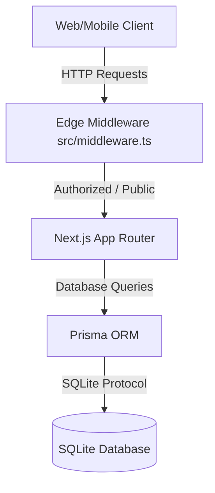

# Nexora Project Architecture Overview

This document provides a high-level overview of the system architecture, technology stack, folder structure, and core design paradigms for the **Nexora** e-commerce platform.

---

## 1. System Context & Tech Stack

Nexora is designed as a modern, high-performance, multi-seller e-commerce backend built on top of the **Next.js** framework and **Prisma ORM**.



### Core Technologies
*   **Application Framework**: Next.js (App Router, utilizing both Edge and Node.js Runtimes).
*   **Database ORM**: Prisma Client (`@prisma/client`).
*   **Database Engine**: SQLite (file-based `dev.db`, suited for light-to-medium development / staging, designed to scale to PostgreSQL or MySQL).
*   **Cryptography & Security**:
    *   `bcryptjs` for secure password hashing and verification.
    *   `jose` for Edge-compatible JSON Web Token (JWT) signing, verification, and decoding.
    *   `otplib` for Time-based One-Time Password (TOTP) generation and verification (Multi-Factor Authentication).
*   **Validation**: `zod` for type-safe runtime validation of request payloads.

---

## 2. Codebase Directory Structure

The project follows a standard Next.js App Router layout with separated library code and API routing:

```
Nexora/
├── prisma/                  # Prisma Configuration & Schema
│   ├── dev.db               # SQLite database file
│   └── schema.prisma        # Database models & relationships
├── src/
│   ├── middleware.ts        # Edge middleware for authorization/routing
│   ├── lib/                 # Core utilities and helper functions
│   │   ├── auth.ts          # Cryptographic hashing & token utility functions
│   │   ├── csv-parser.ts    # Robust custom CSV parser (for bulk upload)
│   │   └── prisma.ts        # Singleton Prisma client instance
│   └── app/                 # Next.js App Router
│       ├── layout.tsx       # Root HTML layout and global styles
│       ├── globals.css      # Custom Tailwind/CSS declarations
│       ├── page.tsx         # Dashboard / Index route page
│       ├── auth/            # Authenticated Views (e.g. login pages)
│       └── api/             # RESTful API Route Handlers
│           ├── addresses/   # User address CRUD operations
│           ├── admin/       # Elevated administrative endpoints
│           ├── auth/        # Login, registration, OTP, sessions, and MFA
│           ├── catalog/     # Public product & brand queries
│           ├── profile/     # User profile metadata and preferences
│           └── users/       # User list and management for admins
```

---

## 3. Key Design Patterns

### Edge-Compatible Authentication & Middleware
Next.js middleware runs on the Vercel Edge Runtime. Standard Node.js library modules (like `crypto` or `bcrypt`) are not supported in the Edge environment. Nexora addresses this by separating concerns:
*   **Token Verification**: Handled inside `src/middleware.ts` using `jose` which relies on standard Web Crypto API.
*   **Password Hashing & Hashing Comparisons**: Handled inside API endpoints (Node.js runtime) using `bcryptjs`.

### Transaction Boundary Protection
Bulk product uploads are executed inside a single database transaction (`prisma.$transaction`). If a single row fails validation (e.g., duplicated SKU, formatting issue), the entire insertion sequence rolls back automatically, preventing partial database updates and data corruption.

### SQLite Fallbacks
SQLite does not natively support rich object column types like `JSON` or `Array` fields. For columns containing flexible attributes (like `ProductVariant.variantAttributes` or `Product.metadata`), values are serialized to JSON strings prior to insertion and deserialized at retrieval. This keeps database interactions portable.

### Multi-Seller Architecture
Products are owned by a `Seller` model. `Warehouse` entities belong to or service different sellers. The inventory is tracked at a matrix level: `Inventory = ProductVariant × Warehouse`. This structure permits granular supply chain tracking.
