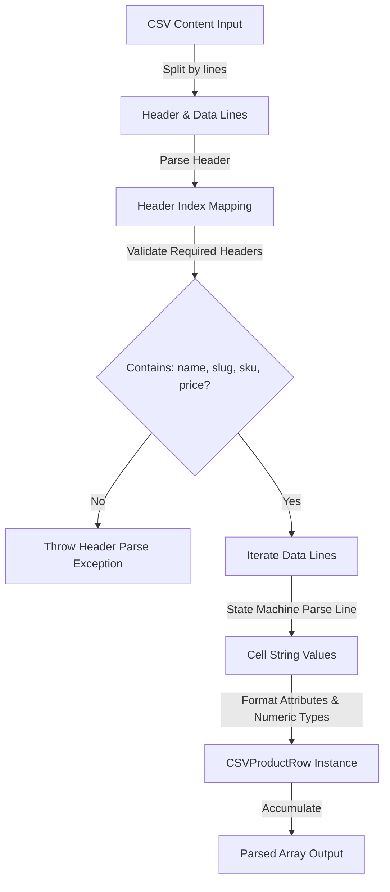

# Nexora Data Import & Database Integrity

This document details the mechanics of Nexora's bulk upload ingestion pipeline, demonstrating how CSV parsing, database schema constraints, and database transactional boundaries are structured.

---

## 1. CSV Parsing Architecture

The file import engine resides in `src/lib/csv-parser.ts`. Instead of introducing heavy third-party parsing dependencies, Nexora leverages a lightweight, custom-coded parser optimized for security and memory safety.



### 1.1 State-Machine Line Parsing
The parser implements a character-loop state machine (`parseCSVLine`) to inspect cells individually:
*   **Quote Detection**: Toggles an `inQuotes` boolean flag when encountering `"` characters.
*   **Delimiter Safety**: Comma characters `,` are only treated as boundaries when `inQuotes` is false. This allows cells to contain embedded commas (e.g. detailed product descriptions or structured tags).
*   **Escape Character Normalization**: Replace double-quotes `""` with a single double-quote `"` and strips outer surrounding bounds.

### 1.2 Case-Insensitive Mapping
Headers are mapped using case-insensitive matches:
```typescript
const nameIdx = header.findIndex(h => h.toLowerCase() === "name")
const slugIdx = header.findIndex(h => h.toLowerCase() === "slug")
const priceIdx = header.findIndex(h => h.toLowerCase() === "price")
const skuIdx = header.findIndex(h => h.toLowerCase() === "sku")
```
If any of these indices return `-1`, the parser raises a runtime exception, preventing processing of misaligned files.

---

## 2. Transaction Boundary Protection

Ingestion takes place in `src/app/api/admin/products/bulk-upload/route.ts` via **Prisma Interactive Transactions** (`prisma.$transaction`).

```
Clientside Request (csvContent)
│
├── 1. Decode & Parse CSV contents 
├── 2. Verify Warehouse & Seller entities exist
├── 3. Execute prisma.$transaction ──┐
│   │                                 │
│   ├── Loop rows                     │
│   │   ├── Check SKU uniqueness      │ [FAIL] -> Automatically rolls back all queries
│   │   ├── Find/Create Brand         │
│   │   ├── Find/Create Product       │
│   │   ├── Create Variant record     │
│   │   └── Create Inventory entry    │
│   │                                 │
│   └── Return compiled SKUs ─────────┘ [SUCCESS] -> Commits data changes to dev.db
│
└── 4. Register AuditLog entry
```

### Why Interactive Transactions?
By enclosing database updates within `prisma.$transaction(async (tx) => { ... })`, the system ensures **atomicity**. If an ingestion file contains 1,000 items and the 999th item has a duplicate SKU, database changes are discarded. This guarantees that:
1.  No orphaned products are created.
2.  Inventory records correspond directly to verified variant SKUs.
3.  The database never reaches an inconsistent partial state.

### Entity Resolution Flow in Transaction:
1.  **SKU Verification**: Queries `tx.productVariant.findUnique` first. If present, throws a rollback error.
2.  **Brand Connect/Create**: Queries brand existence. Inserts if absent to secure a foreign key ID reference.
3.  **Product Container Resolution**: Resolves target products using `slug`. Multiple SKUs (variants like size/color differences) under the same name link to a single parent Product.
4.  **Category Ingestion**: Iterates category CSV arrays, creating missing category tags on-the-fly and generating join records (`ProductCategory`).
5.  **Variant & Inventory Creation**: Injects the `ProductVariant` record and seeds stock records (`Inventory`) inside the target `Warehouse`.
