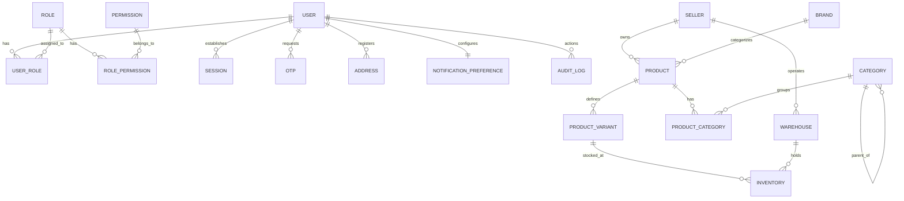

# Nexora Database Schema Design

This document details the database architecture of Nexora, explaining key relationships, entity definitions, and table details as specified in the Prisma schema file (`prisma/schema.prisma`).

---

## 1. Entity Relationship Diagram

---

## 2. Table Specifications & Role Definitions

### 2.1 Identity & Access Management (RBAC)

Nexora features a Role-Based Access Control system mapped via join tables.

*   `User`: Represents system accounts (customers, administrators, sellers, warehouse managers).
    *   `id`: UUID Primary Key.
    *   `email`: String (Unique).
    *   `status`: Pending Verification (`pending_verification`), Active (`active`), or Suspended (`suspended`).
    *   `isMfaEnabled`: Boolean flag for two-factor verification.
    *   `mfaSecret`: TOTP secret (encrypted/stored securely).
*   `Role`: Defines access tiers. Default roles include:
    *   `super_admin`, `admin`, `seller`, `warehouse_manager`, `support_executive`, `finance_team`, `customer`.
*   `Permission`: Individual resource-level rules mapping capabilities.
*   `UserRole` & `RolePermission`: Link tables handling many-to-many associations with cascading deletions (`onDelete: Cascade`).

---

### 2.2 Sessions & Authentications

*   `Session`: Stores tokens and client request meta.
    *   `refreshTokenHash`: Unique string mapped directly to the cookie's JWT token payload.
    *   `ipAddress` & `userAgent`: Track login context for fraud detection and auditing.
    *   `isRevoked`: Boolean flag allowing administrative token revocation.
*   `Otp`: Handles temporary 6-digit codes.
    *   `purpose`: Enum stored as string: `email_verification`, `mfa`, or `password_reset`.
    *   `expiresAt`: Access cut-off timestamp.

---

### 2.3 Catalog & Logistics (Multi-Seller Inventory)

*   `Seller`: The entity listing products. Maps to one-to-many `Product` profiles and owns multiple `Warehouse` stores.
*   `Brand`: Model grouping products.
*   `Category`: Features a self-referencing relationship:
    *   `parentId`: References parent `Category.id` to allow hierarchical subcategories.
*   `Product`: Core container details.
    *   `visibility`: Visibility settings (`public`, `hidden`, `draft`).
    *   `seoTitle`, `seoDescription`, `seoKeywords`: Fields dynamically injected for search engine optimization.
    *   `tags`: Stringified JSON array of marketing tag strings.
    *   `recommendations`: Stringified JSON array of recommended product IDs.
    *   `metadata`: SQLite dynamic JSON storage format. Stored as stringified JSON representing schema extensions.
*   `ProductVariant`: SKU level detail.
    *   `barcode`: Unique variant barcode string (EAN/UPC identifier).
    *   `price`: Floating value representation.
    *   `compareAtPrice`: Stored for retail list markdown comparison.
    *   `variantAttributes`: Stores stringified JSON maps (e.g. `{"color": "Navy", "size": "L"}`).
    *   `images`: Stringified JSON list of variant image URLs.
    *   `videos`: Stringified JSON list of variant product demonstration video URLs.
*   `Warehouse`: Storage distribution centers.
*   `Inventory`: Links `ProductVariant` to `Warehouse`.
    *   `quantityAvailable`: Unreserved items ready for customer checkout.
    *   `quantityReserved`: Items inside shopping carts or pending checkout fulfillment.
*   `Cart`: Active cart container mapped to logged-in user or guest session.
*   `CartItem`: Variant links inside cart, featuring `isSavedForLater` toggle flag.
*   `Coupon`: Sales promo coupon definitions (fixed vs percentage discount types).
*   `GiftCard`: Gift card ledger tracking balance vouchers.
*   `Order`: Order placement transaction record capturing payment status, shipping parameters, billing addresses, wallet amount used, and tracking status.
*   `OrderItem`: Historical snapshot capturing variant price and quantity purchased.
*   `UserWallet`: Wallet tracking credit balances.
*   `Review`: Product feedback reviews tracking ratings (1-5) and user comments.
*   `SystemConfig`: Platform configurations, feature flag parameters, and CMS banners JSON.
*   `NotificationJob`: Transactional queue tracking message states, channels, payloads, and retry parameters.
*   `PageVisit`: Logs visitor page transitions, routes, and paths.
*   `ClickLog`: Captures pixel coordinates (x, y) of selector clicks to plot visual heatmaps.

---

### 2.4 Audit & Logs

*   `AuditLog`: Tracks mutation actions.
    *   `userId`: Actor UUID (Null if automated or system task).
    *   `action`: String identifier (e.g. `user_login`, `bulk_upload_products_csv`).
    *   `tableName` & `rowId`: Target coordinates.
    *   `oldValues` & `newValues`: Stringified JSON payloads showing row transformations (diff states). Used for security analysis and debugging.
